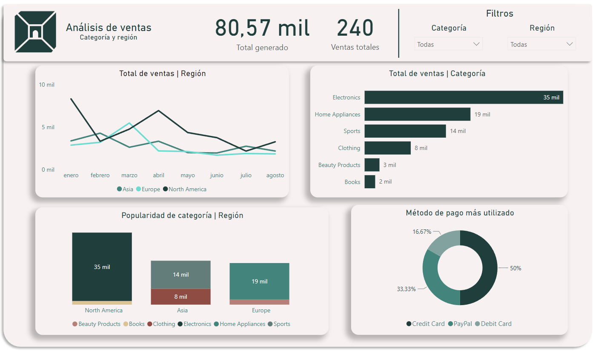

# Documentación técnica

## Descripción del problema
Se requiere crear un pipeline de datos que lea un archivo `.csv` de transacciones de ventas en línea, realice una transformación simple y almacene los datos transformados en una base de datos.

## Solución Implementada
1. **Lectura de Datos:**
   - Utilicé la librería *Pandas* para leer los datos del archivo `.csv`
2. **Transformación de Datos:**
   - Cambié el tipo de datos de la columna “Date” a *datetime*.
3. **Almacenamiento en Base de Datos:**
   - Utilicé *SQLAlchemy* para guardar los datos transformados en una tabla *PostgreSQL*.

## Mantenimiento del pipeline
Para mantener este pipeline, se deben realizar las siguientes acciones:
- Verificar periódicamente la integridad de los datos.
- Actualizar las dependencias de Python.
- Monitorizar el rendimiento de la base de datos y optimizar las consultas si es necesario.

## Visualización de datos
Se realizó un dashboard dinámico con la herramienta Power BI

